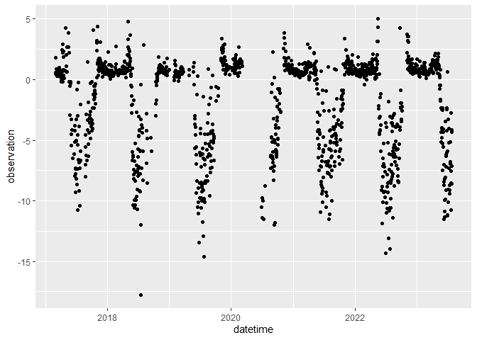
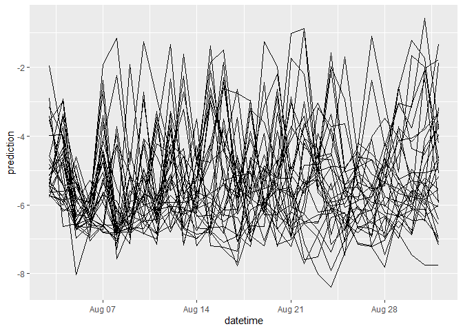
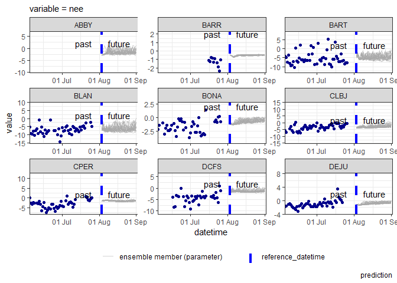

-   <a href="#this-r-markdown-document" id="toc-this-r-markdown-document">1
    This R markdown document</a>
-   <a href="#introduction-to-neon-forecast-challenge"
    id="toc-introduction-to-neon-forecast-challenge">2 Introduction to NEON
    Forecast challenge</a>
    -   <a href="#terrestrial-challenge" id="toc-terrestrial-challenge">2.1
        Terrestrial challenge</a>
    -   <a href="#submission-requirements" id="toc-submission-requirements">2.2
        Submission requirements</a>
-   <a href="#the-forecasting-workflow" id="toc-the-forecasting-workflow">3
    The forecasting workflow</a>
    -   <a href="#read-in-the-data" id="toc-read-in-the-data">3.1 Read in the
        data</a>
    -   <a href="#visualise-the-data" id="toc-visualise-the-data">3.2 Visualise
        the data</a>
-   <a href="#introducing-co-variates" id="toc-introducing-co-variates">4
    Introducing co-variates</a>
    -   <a href="#download-co-variates" id="toc-download-co-variates">4.1
        Download co-variates</a>
        -   <a href="#download-historic-data" id="toc-download-historic-data">4.1.1
            Download historic data</a>
        -   <a href="#download-future-weather-forecasts"
            id="toc-download-future-weather-forecasts">4.1.2 Download future weather
            forecasts</a>
-   <a href="#model-1-linear-model-with-covariates"
    id="toc-model-1-linear-model-with-covariates">5 Model 1: Linear model
    with covariates</a>
    -   <a href="#convert-to-efi-standard-for-submission"
        id="toc-convert-to-efi-standard-for-submission">5.1 Convert to EFI
        standard for submission</a>
    -   <a href="#submit-forecast" id="toc-submit-forecast">5.2 Submit
        forecast</a>
    -   <a href="#workshop-tasks" id="toc-workshop-tasks">5.3 Workshop tasks</a>
    -   <a href="#register-your-participation"
        id="toc-register-your-participation">5.4 Register your participation</a>
    -   <a href="#automate-your-forecasts" id="toc-automate-your-forecasts">5.5
        Automate your forecasts!</a>
    -   <a href="#see-how-your-forecasts-perform"
        id="toc-see-how-your-forecasts-perform">5.6 See how your forecasts
        perform</a>

# 1 This R markdown document

This document present workshop materials presented at the ESA 2023
workshop “Can You Predict the Future? Introducing the NEON Ecological
Forecasting Challenge.” The development of these materials has been
supported by NSF grants DEB-1926388 and DBI-1933016.

To complete the workshop via this markdown document the following
packages will need to be installed:

-   `remotes`
-   `tidyverse`
-   `lubridate`
-   `neon4cast` (from github)

The following code chunk should be run to install packages.

``` r
install.packages('remotes')
install.packages('tidyverse') # collection of R packages for data manipulation, analysis, and visualisation
install.packages('lubridate') # working with dates and times
remotes::install_github('eco4cast/neon4cast') # package from NEON4cast challenge organisers to assist with forecast building and submission
```

Additionally, R version 4.2 is required to run the `neon4cast` package.
It’s also worth checking your Rtools is up to date and compatible with R
4.2, see
(<https://cran.r-project.org/bin/windows/Rtools/rtools42/rtools.html>).

``` r
version$version.string
```

    ## [1] "R version 4.2.0 (2022-04-22 ucrt)"

``` r
library(tidyverse)
```

    ## ── Attaching core tidyverse packages ──────────────────────── tidyverse 2.0.0 ──
    ## ✔ dplyr     1.0.10     ✔ readr     2.1.3 
    ## ✔ forcats   1.0.0      ✔ stringr   1.5.0 
    ## ✔ ggplot2   3.4.2      ✔ tibble    3.1.8 
    ## ✔ lubridate 1.9.2      ✔ tidyr     1.3.0 
    ## ✔ purrr     1.0.1      
    ## ── Conflicts ────────────────────────────────────────── tidyverse_conflicts() ──
    ## ✖ dplyr::filter() masks stats::filter()
    ## ✖ dplyr::lag()    masks stats::lag()
    ## ℹ Use the ]8;;http://conflicted.r-lib.org/conflicted package]8;; to force all conflicts to become errors

``` r
library(lubridate)
```

If you do not wish to run the code yourself you can follow along via the
rendered markdown document
(NEON_forecast_challenge_workshop_terrestrial.md).

Note: if you are familiar with and comfortable using Docker containers
you can run these materials easily using the `eco4cast/rocker-neon4cast`
Docker image which has all the packages pre-installed in a stable Linux
environment. To run in Docker, follow the instructions
[here](https://rocker-project.org) for running an Rstudio instance and
substitute `eco4cast/rocker-neon4cast` for `rocker/rstudio`.

# 2 Introduction to NEON Forecast challenge

The EFI RCN NEON Forecast Challenge provides a platform for the
scientific community to produce ecological forecasts of future
conditions at NEON sites by leveraging NEON’s open-source data products.
The Challenge is split into five themes that span aquatic and
terrestrial systems, and population, community, and ecosystem processes
across a broad range of ecoregions. We are excited to use this Challenge
to learn more about the predictability of ecological processes by
forecasting NEON data before it is collected.

Within this workshop we will focus on the terrestrial daily theme, as an
example, but the approaches, workflow and tools are applicable to all
themes.

Which modeling frameworks, mechanistic processes, and statistical
approaches best capture community, population, and ecosystem dynamics?
These questions are answerable by a community generating a diverse array
of forecasts. The Challenge is open to any individual or team from
anywhere around the world that wants to submit forecasts. Sign up
[here](https://projects.ecoforecast.org/neon4cast-docs/Participation.html).

## 2.1 Terrestrial challenge

Overview: The exchange of water and carbon dioxide between the
atmosphere and the land is akin to earth’s terrestrial ecosystems
breathing rate and lung capacity. One of the best ways to monitor
changes in the amount of carbon and water in an ecosystem is the
*eddy-covariance method*. This method observes the net amount of carbon
and water entering and exiting ecosystems at each timestep, providing
information on ecosystem processes such as photosynthesis, respiration,
and transpiration. Forecasts of carbon uptake and release along with
water use can provide insights into future production of food, fiber,
timber, and carbon credits. Additionally, forecasts will highlight the
influence that stress and disturbance have on carbon and water cycling.
[Learn more](https://www.youtube.com/watch?v=CR4Anc8Mkas).

What: Net ecosystem exchange of CO2 and evapotranspiration in
terrestrial ecosystems. Forecasts can be submitted at a daily or 30
minute timestep.

Where: 47 NEON sites across the U.S. and Puerto Rico.

When: Daily forecasts for at least 30-days in the future. New forecast
submissions, that use newly collected data, are accepted daily. The only
requirement is that submissions are predictions of the future at the
time the forecast is submitted.

Today we will focus on forecasts of net ecosystem exchange of CO2 (NEE)
at a daily time step in g C m-2 day-1. Negative values correspond to an
ecosystem absorbing CO2 from the atmosphere, positive values correspond
to an ecosystem emitting CO2 to the atmosphere. Find more information
about the terrestrial challenge
[here](https://projects.ecoforecast.org/neon4cast-docs/Terrestrial.html).

## 2.2 Submission requirements

For the Challenge, forecasts must include quantified `uncertainty`. The
forecast can represent uncertainty using an `ensemble` forecast
(multiple realizations of future conditions) or a `distribution`
forecast (with mean and standard deviation), specified in the family and
parameter columns of the forecast file.

For an ensemble forecast, the `family` column uses the word `ensemble`
to designate that it is a ensemble forecast and the parameter column is
the ensemble member number (1, 2, 3 …). An alternative way to represent
uncertainty would be to use a distribution forecast. For this, the
`family` column uses the word `normal` to designate a normal
distribution and the parameter column must have the words `mu` and
`sigma` for each forecasted variable, site_id, and datetime. For
forecasts that don’t have a normal distribution we recommend using the
ensemble format and sampling from your non-normal distribution to
generate a set of ensemble members that represents your distribution.

The full list of required columns and format can be found in the
[Challenge
documentation](https://projects.ecoforecast.org/neon4cast-docs/Submission-Instructions.html).

# 3 The forecasting workflow

## 3.1 Read in the data

We start forecasting by first looking at the historic data - called the
`targets` (`targets` = what we are trying to forecast). These data are
available with a 5 day delay (latency). Here is how you read in the data
from the targets file available from the EFI server.

``` r
#read in the targets data
targets <- readr::read_csv("https://data.ecoforecast.org/neon4cast-targets/terrestrial_daily/terrestrial_daily-targets.csv.gz", guess_max = 1e6) |> 
  na.omit()
```

Information on the NEON sites can be found in the
`NEON_Field_Site_Metadata_20220412.csv` file on GitHub. It can be
filtered to only include terrestrial sites. This table has information
about the field sites, including location, ecoregion, information
vegetation type (`phenocam_vegetation`), canopy height, and soil type.

``` r
# read in the sites data
site_data <- readr::read_csv("https://raw.githubusercontent.com/eco4cast/neon4cast-targets/main/NEON_Field_Site_Metadata_20220412.csv") |> 
  dplyr::filter(terrestrial == 1)
```

Let’s take a look at the targets data!

    ## # A tibble: 11 × 4
    ##    datetime   site_id variable observation
    ##    <date>     <chr>   <chr>          <dbl>
    ##  1 2017-08-26 KONZ    nee           -1.59 
    ##  2 2017-08-26 LENO    le            35.3  
    ##  3 2017-08-26 LENO    nee           -5.16 
    ##  4 2017-08-26 RMNP    le           106.   
    ##  5 2017-08-26 RMNP    nee           -1.24 
    ##  6 2017-08-26 STER    le            28.8  
    ##  7 2017-08-26 STER    nee           -0.399
    ##  8 2017-08-26 TREE    le            16.8  
    ##  9 2017-08-26 TREE    nee           -0.375
    ## 10 2017-08-26 UKFS    le            83.0  
    ## 11 2017-08-26 UKFS    nee           -2.29

The columns of the targets file show the time step (daily for the
terrestrial daily challenge), the 4 character site code (`site_id`), the
variable being measured, and the mean daily observation. We will filter
the targets to look at only the NEE (`nee`).

``` r
variable_interest <- 'nee'
targets <- targets |> 
  dplyr::filter(variable == variable_interest)
```

## 3.2 Visualise the data


We can think about what type of models might be useful to predict these
variables at these sites. Below are descriptions of three simple models
to get you started forecasting:

-   We could use information about recent conditions to predict the
    future. What is happening today might be a good predictor of what
    will happen tomorrow.
-   What does the historic data tell us about this time of year? Is this
    time of year likely to be similar the same period last year?
-   We could also look at the variable’s relationship with other
    variables. Could we use existing forecasts of the weather to
    generate forecasts of terrestrial fluxes?

In this tutorial, we will focus on the third model - a forecast using
co-variates.

# 4 Introducing co-variates

One important step to overcome when thinking about generating forecasts
is how to include co-variates in the model. A forecast of NEE, for
example, may benefit from information about past and future weather. The
Challenge organisers have compiled past and future NOAA weather
forecasts for all of the NEON sites that are available for teams to use
and accessed using the `neon4cast` package (which was installed above).
The 3 types of data are as follows:

-   stage_1: raw forecasts - 31 member ensemble forecasts at 3 hr
    intervals for the first 10 days, and 6 hr intervals for up to 35
    days at the NEON sites.
-   stage_2: a processed version of Stage 1 in which fluxes are
    standardized to per second rates, fluxes and states are interpolated
    to 1 hour intervals and variables are renamed to match conventions.
    We recommend this for obtaining future weather by using
    `neon4cast::noaa_stage2()`. Future weather forecasts include a
    30-member ensemble of equally likely future weather conditions.
-   stage_3: can be viewed as the “historical” weather and is
    combination of day 1 weather forecasts (i.e., when the forecasts are
    most accurate). You can download this “stacked” NOAA product using
    `neon4cast::noaa_stage3()`. Can be used for model training.

All NOAA weather forecast products are an *ensemble forecast*, meaning
that they have multiple simulations of future conditions. 30 ensemble
members (simulations) go out 35 days into the future, giving 30
potential future scenarios that we can use in our ecological forecast.

These `neon4cast` functions create a connection to the data that is
hosted on the eco4cast server. To download the data you have to tell the
function to `collect()` it. These data set can be subsetted and filtered
using `dplyr` functions prior to download to limit the memory usage.

You can read more about the NOAA forecasts available for the NEON sites
[here:](https://projects.ecoforecast.org/neon4cast-docs/Shared-Forecast-Drivers.html)

## 4.1 Download co-variates

### 4.1.1 Download historic data

We will generate a `nee` forecast using `air_temperature` and
`solar_radiation` as a co-variates. As an example of the workflow we
will work with 1 site - HARV (Harvard deciduous forest).

``` r
example_site <- 'HARV'

targets |> 
  filter(site_id  == example_site) |> 
  ggplot(aes(x=datetime, y= observation)) +
  geom_point()
```



We will create a connection to the remote dataset using the
`noaa_stage3` function and then using common `dplyr` verbs to subset
remotely before bringing the data locally using `collect()`.

``` r
example_site <- 'HARV'

# past stacked weather for training
df_past <- neon4cast::noaa_stage3()

variables <- c("air_temperature", "surface_downwelling_shortwave_flux_in_air")
#Other variable names can be found at https://projects.ecoforecast.org/neon4cast-docs/Shared-Forecast-Drivers.html#stage-2

noaa_past_example <- df_past |> 
  # from this connection subset the dataset using filter()
  dplyr::filter(site_id %in% example_site,
                datetime >= ymd('2017-01-01'),
                variable %in% variables) |> 
  dplyr::collect()

noaa_past_example[1:10,]
```

    ## # A tibble: 10 × 9
    ##    datetime            site_id longitude latitude family   parameter variable   
    ##    <dttm>              <chr>       <dbl>    <dbl> <chr>        <int> <chr>      
    ##  1 2020-09-25 00:00:00 HARV        -72.2     42.5 ensemble         1 air_temper…
    ##  2 2020-09-25 00:00:00 HARV        -72.2     42.5 ensemble         2 air_temper…
    ##  3 2020-09-25 00:00:00 HARV        -72.2     42.5 ensemble         3 air_temper…
    ##  4 2020-09-25 00:00:00 HARV        -72.2     42.5 ensemble         4 air_temper…
    ##  5 2020-09-25 00:00:00 HARV        -72.2     42.5 ensemble         5 air_temper…
    ##  6 2020-09-25 00:00:00 HARV        -72.2     42.5 ensemble         6 air_temper…
    ##  7 2020-09-25 00:00:00 HARV        -72.2     42.5 ensemble         7 air_temper…
    ##  8 2020-09-25 00:00:00 HARV        -72.2     42.5 ensemble         8 air_temper…
    ##  9 2020-09-25 00:00:00 HARV        -72.2     42.5 ensemble         9 air_temper…
    ## 10 2020-09-25 00:00:00 HARV        -72.2     42.5 ensemble        10 air_temper…
    ## # ℹ 2 more variables: height <chr>, prediction <dbl>

This is a stacked ensemble forecast of the one day ahead hourly
forecasts (each day has 30 ensemble members or simulations). To get an
estimate of the historic conditions we can take a mean of these
ensembles. We will also convert the temperatures to Celsius from Kelvin
and rename the shortwave variable.

``` r
# aggregate the past to mean values
noaa_past_mean_example <- noaa_past_example |> 
  mutate(datetime = as_date(datetime)) |> 
  group_by(datetime, site_id, variable) |>
  # calculate a daily mean
  summarize(prediction = mean(prediction, na.rm = TRUE), .groups = "drop") |> 
  pivot_wider(names_from = variable, values_from = prediction) |> 
  # convert air temp to C
  rename(shortwave = surface_downwelling_shortwave_flux_in_air) |> 
  mutate(air_temperature = air_temperature - 273.15)


head(noaa_past_mean_example)
```

    ## # A tibble: 6 × 4
    ##   datetime   site_id air_temperature shortwave
    ##   <date>     <chr>             <dbl>     <dbl>
    ## 1 2020-09-25 HARV               12.9      186.
    ## 2 2020-09-26 HARV               12.9      203.
    ## 3 2020-09-27 HARV               13.3      104.
    ## 4 2020-09-28 HARV               14.6      145.
    ## 5 2020-09-29 HARV               13.3      118.
    ## 6 2020-09-30 HARV               13.1      117.

We can then look at the future weather forecasts in the same way but
using the `noaa_stage2()`. The forecasts become available from NOAA at
5am UTC the *following* day, so we take the air temperature and
shortwave forecast from yesterday (`noaa_date`) to make the NEE
forecasts. Then we can use the weather forecast ensembles to produce
uncertainty in the NEE forecast by forecasting multiple (30) future
conditions.

### 4.1.2 Download future weather forecasts

``` r
# New forecast only available at 5am UTC the next day

forecast_date <- Sys.Date() 
noaa_date <- forecast_date - days(1)

df_future <- neon4cast::noaa_stage2(start_date = as.character(noaa_date)) 
                                            # the start date is a string

variables <- c("air_temperature", "surface_downwelling_shortwave_flux_in_air")

noaa_future_example <- df_future |> 
  dplyr::filter(reference_datetime == noaa_date,
                datetime >= forecast_date,
                site_id %in% example_site,
                variable %in% variables,
                # Only need a 30 day horizon (today + 30 days, 31 *24)
                horizon < 744,
                # ensemble member 31 only goes to 16 days
                parameter < 31) |> 
  dplyr::collect()
noaa_future_example
```

    ## # A tibble: 43,200 × 12
    ##    site_id prediction variable      height horizon parameter reference_datetime 
    ##    <chr>        <dbl> <chr>         <chr>    <dbl>     <int> <dttm>             
    ##  1 HARV             0 surface_down… surfa…      24         1 2023-08-02 00:00:00
    ##  2 HARV             0 surface_down… surfa…      25         1 2023-08-02 00:00:00
    ##  3 HARV             0 surface_down… surfa…      26         1 2023-08-02 00:00:00
    ##  4 HARV             0 surface_down… surfa…      27         1 2023-08-02 00:00:00
    ##  5 HARV             0 surface_down… surfa…      28         1 2023-08-02 00:00:00
    ##  6 HARV             0 surface_down… surfa…      29         1 2023-08-02 00:00:00
    ##  7 HARV             0 surface_down… surfa…      30         1 2023-08-02 00:00:00
    ##  8 HARV             0 surface_down… surfa…      31         1 2023-08-02 00:00:00
    ##  9 HARV             0 surface_down… surfa…      32         1 2023-08-02 00:00:00
    ## 10 HARV             0 surface_down… surfa…      33         1 2023-08-02 00:00:00
    ## # ℹ 43,190 more rows
    ## # ℹ 5 more variables: forecast_valid <chr>, datetime <dttm>, longitude <dbl>,
    ## #   latitude <dbl>, family <chr>

These forecasts are hourly and we are interested in using daily mean air
temperature and shortwave for NEE forecast generation. But for our
future predictions, we will retain each ensemble member as an estimate
of driver uncertainty in the NEE forecast. Again, we will convert
temperature to degree C and rename the shortwave variable.

``` r
noaa_future_daily_example <- noaa_future_example |> 
  mutate(datetime = as_date(datetime)) |> 
  # mean daily forecasts at each site per ensemble
  group_by(datetime, site_id, parameter, variable) |> 
  summarize(prediction = mean(prediction)) |>
  pivot_wider(names_from = variable, values_from = prediction) |>
  # convert to Celsius
  mutate(air_temperature = air_temperature - 273.15) |> 
  rename(shortwave = surface_downwelling_shortwave_flux_in_air) |> 
  select(datetime, site_id, air_temperature, shortwave, parameter)

noaa_future_daily_example
```

    ## # A tibble: 900 × 5
    ## # Groups:   datetime, site_id, parameter [900]
    ##    datetime   site_id air_temperature shortwave parameter
    ##    <date>     <chr>             <dbl>     <dbl>     <int>
    ##  1 2023-08-03 HARV               17.3      233.         1
    ##  2 2023-08-03 HARV               16.1      295.         2
    ##  3 2023-08-03 HARV               16.9      296.         3
    ##  4 2023-08-03 HARV               16.9      303.         4
    ##  5 2023-08-03 HARV               17.5      316.         5
    ##  6 2023-08-03 HARV               16.7      144.         6
    ##  7 2023-08-03 HARV               17.2      280.         7
    ##  8 2023-08-03 HARV               16.8      254.         8
    ##  9 2023-08-03 HARV               17.1      227.         9
    ## 10 2023-08-03 HARV               17.2      287.        10
    ## # ℹ 890 more rows

Now we have a timeseries of historic data and a 30 member ensemble
forecast of future air temperatures and shortwave for one site.


# 5 Model 1: Linear model with covariates

We will fit a simple linear model between historic air temperature and
shortwave radiation and the net ecosystem exchange targets data. Using
this model we can then use our future estimates of air temperature (all
30 ensembles) to estimate NEE The ensemble weather forecast will
therefore propagate uncertainty into the NEE forecast and give an
estimate of driving data uncertainty.

We will start by joining the historic weather data with the targets to
aid in fitting the linear model.

``` r
targets_lm_example <- targets |> 
  filter(site_id %in% example_site) |> 
  pivot_wider(names_from = 'variable', 
              values_from = 'observation') |> 
  left_join(noaa_past_mean_example, 
            by = c("datetime","site_id"))

tail(targets_lm_example)
```

    ## # A tibble: 6 × 5
    ##   datetime   site_id    nee air_temperature shortwave
    ##   <date>     <chr>    <dbl>           <dbl>     <dbl>
    ## 1 2023-07-21 HARV     -2.73            20.0      253.
    ## 2 2023-07-22 HARV    -10.8             19.5      339.
    ## 3 2023-07-23 HARV     -8.60            20.8      341 
    ## 4 2023-07-24 HARV     -7.12            21.7      308.
    ## 5 2023-07-25 HARV     -4.17            20.8      293.
    ## 6 2023-07-26 HARV     -4.34            21.4      328.

To fit the linear model we use the base R `lm()` but there are also
methods to fit linear (and non-linear) models in the `fable::` package.
You can explore the
[documentation](https://otexts.com/fpp3/regression.html) for more
information on the `fable::TSLM()` function.

We can fit a separate linear model for each site. For example, at HARV
forest (HARV), this would look like:

``` r
#Fit linear model based on past data: NEE = a * air temperature + b * shortwave
fit <- lm(targets_lm_example$nee ~ targets_lm_example$air_temperature + targets_lm_example$shortwave)
    
# use linear regression to forecast NEE for each ensemble member
forecasted_nee <- fit$coefficients[1] + 
  (fit$coefficients[2] * noaa_future_daily_example$air_temperature) + 
  (fit$coefficients[3] * noaa_future_daily_example$shortwave)
```

``` r
  # put all the relevent information into a tibble that we can bind together
  NEE <- data.frame(datetime = noaa_future_daily_example$datetime,
                    site_id = "HARV",
                    parameter = noaa_future_daily_example$parameter,
                    prediction = forecasted_nee,
                    variable = "nee")
  
  ggplot(NEE, aes(x = datetime, y = prediction, group = parameter)) +
    geom_line()
```



``` r
  # Some edits would be needed to submit to the challenge... see commented code
  
  #   my_model_id <- 'nee_test'
  # 
  # NEE_forecast_EFI <- NEE %>%
  #   mutate(model_id = my_model_id,
  #          reference_datetime = as_date(min(datetime)) - days(1),
  #          family = 'ensemble',
  #          parameter = as.character(parameter)) %>%
  # select(model_id, datetime, reference_datetime, site_id, family, parameter, variable, prediction)
```

**A forecast!!**

We can loop through this workflow that we just did for HARV for each
site to create a site-wise forecast of NEE based on a linear model and
each forecast of air temperature and shortwave. We can run this forecast
for each site and then bind them together to submit as one forecast to
the Challenge.

Our worflow might look like this:

1.  Download historic NOAA data
2.  Download future NOAA forecast
3.  Fit the model
4.  Forecast!
5.  Bind this all together…

Note: This loop can take a while to execute, depending on your internet
connection and computer memory, so start it running as soon as possible
in the workshop period…

``` r
# Create the connections to data products
df_past <- neon4cast::noaa_stage3()
```

    ## establishing connection to stage3/parquet at data.ecoforecast.org ...

    ## connected! Use dplyr functions to filter and summarise.
    ## Then, use collect() to read result into R

``` r
forecast_date <- Sys.Date() 
noaa_date <- forecast_date - days(1)
df_future <- neon4cast::noaa_stage2(start_date = as.character(noaa_date))
```

    ## establishing connection to stage2/parquet/0/2023-08-02 at data.ecoforecast.org ...
    ## connected! Use dplyr functions to filter and summarise.
    ## Then, use collect() to read result into R

``` r
# specify the covariates
variables <- c("air_temperature", "surface_downwelling_shortwave_flux_in_air")

# create some empty objects to assign things to
lm_forecast <- NULL
model_fit <- NULL


## Stash NOAA locally. This will speed up the access to NOAA by writing a local copy that we query
df_past |>
    dplyr::filter(datetime >= ymd('2017-01-01'),
                  variable %in% variables,
                  site_id %in% site_data$field_site_id) |>
    arrow::write_dataset("noaa_past", partitioning="site_id")

df_future |>
    dplyr::filter(reference_datetime == noaa_date,
                  datetime >= forecast_date,
                  variable %in% variables,
                  site_id %in% site_data$field_site_id,
                  horizon < 744,
                  parameter < 31) |>
    arrow::write_dataset("noaa_future", partitioning="site_id")


for(i in 1:length(site_data$field_site_id)) {  
  
  site <- site_data$field_site_id[i]
  
  # 1. Get historic NOAA data
  noaa_past <- arrow::open_dataset('noaa_past') |> 
    dplyr::filter(site_id %in% site,
                  datetime >= ymd('2017-01-01'),
                  variable %in% variables) |> 
    dplyr::collect()
  
  # calculate a daily mean to fit the model
  noaa_past_daily <- noaa_past |> 
    mutate(datetime = as_date(datetime)) |> 
    group_by(datetime, site_id, variable) |> 
    summarize(prediction = mean(prediction, na.rm = TRUE), .groups = "drop") |> 
    pivot_wider(names_from = variable, values_from = prediction) |> 
    # convert air temp to C
    rename(shortwave = surface_downwelling_shortwave_flux_in_air) |> 
    mutate(air_temperature = air_temperature - 273.15)
  
  # message('Stage 3 for ', site)

  
  #2. Get future NOAA data
  # Download the stage2 data
  noaa_future <- arrow::open_dataset('noaa_future') |> 
    dplyr::filter(reference_datetime == noaa_date,
                  datetime >= forecast_date,
                  site_id == site,
                  variable %in% variables,
                  horizon < 744,
                  parameter < 31) |> 
    dplyr::collect()
  
  # generate a mean daily forecast to use in the forecast
  noaa_future_daily <- noaa_future |> 
    mutate(datetime = as_date(datetime)) |> 
    # mean daily forecasts at each site per ensemble
    group_by(datetime, site_id, parameter, variable) |> 
    summarize(prediction = mean(prediction)) |>
    pivot_wider(names_from = variable, values_from = prediction) |>
    # convert to Celsius
    mutate(air_temperature = air_temperature - 273.15) |> 
    rename(shortwave = surface_downwelling_shortwave_flux_in_air) |> 
    select(datetime, site_id, air_temperature, shortwave, parameter)
  
   # message('Stage 2 for ', site)
  
  #3. Fit the model
    # targets data reformatted to aid model fitting

   targets_lm <- targets |> 
     filter(site_id == site) |> 
     pivot_wider(names_from = 'variable', values_from = 'observation') |> 
     left_join(noaa_past_daily, 
            by = c("datetime","site_id"))
  
  #Fit linear model based on past data
  fit <- lm(targets_lm$nee ~ targets_lm$air_temperature + targets_lm$shortwave)
    
  # use linear regression to forecast NEE for each ensemble member
  forecasted_nee <- fit$coefficients[1] + 
    (fit$coefficients[2] * noaa_future_daily$air_temperature) + 
    (fit$coefficients[3] * noaa_future_daily$shortwave)
    
  # put all the relevant information into a tibble that we can bind together
  NEE <- tibble(datetime = noaa_future_daily$datetime,
                        site_id = site,
                        parameter = noaa_future_daily$parameter,
                        prediction = forecasted_nee,
                        variable = "nee")
  
  lm_forecast <- dplyr::bind_rows(lm_forecast, NEE)
  message(site, ' NEE forecast run')
  
  # extract the model fit
  # you can comment/uncomment this out to extract the R-squared from the model summary
  
  model_fit <- dplyr::bind_rows(model_fit, data.frame(site_id = site,
                                                      r_squared = summary(fit)$r.squared))
  
  
}
```

    ## ABBY NEE forecast run

    ## BARR NEE forecast run

    ## BART NEE forecast run

    ## BLAN NEE forecast run

    ## BONA NEE forecast run

    ## CLBJ NEE forecast run

    ## CPER NEE forecast run

    ## DCFS NEE forecast run

    ## DEJU NEE forecast run

    ## DELA NEE forecast run

    ## DSNY NEE forecast run

    ## GRSM NEE forecast run

    ## GUAN NEE forecast run

    ## HARV NEE forecast run

    ## HEAL NEE forecast run

    ## JERC NEE forecast run

    ## JORN NEE forecast run

    ## KONA NEE forecast run

    ## KONZ NEE forecast run

    ## LAJA NEE forecast run

    ## LENO NEE forecast run

    ## MLBS NEE forecast run

    ## MOAB NEE forecast run

    ## NIWO NEE forecast run

    ## NOGP NEE forecast run

    ## OAES NEE forecast run

    ## ONAQ NEE forecast run

    ## ORNL NEE forecast run

    ## OSBS NEE forecast run

    ## PUUM NEE forecast run

    ## RMNP NEE forecast run

    ## SCBI NEE forecast run

    ## SERC NEE forecast run

    ## SJER NEE forecast run

    ## SOAP NEE forecast run

    ## SRER NEE forecast run

    ## STEI NEE forecast run

    ## STER NEE forecast run

    ## TALL NEE forecast run

    ## TEAK NEE forecast run

    ## TOOL NEE forecast run

    ## TREE NEE forecast run

    ## UKFS NEE forecast run

    ## UNDE NEE forecast run

    ## WOOD NEE forecast run

    ## WREF NEE forecast run

    ## YELL NEE forecast run

We now have 30 possible forecasts of NEE at each site and each day. On
this plot each line represents one of the possible forecasts and the
range of forecasted NEE is a simple quantification of the uncertainty in
our forecast.

Looking back at the forecasts we produced:



## 5.1 Convert to EFI standard for submission

For an ensemble forecast the documentation specifies the following
columns:

-   `datetime`: forecast time stamp for each time step
-   `reference_datetime`: The start of the forecast; this should be 0
    times steps in the future. This should only be one value of
    reference_datetime in the file. So for real-time forecasts this will
    be the `Sys.Date`.
-   `site_id`: NEON code for site
-   `family`: name of forecast type described by the parameter values in
    the parameter column; only `normal` or `ensemble` are currently
    allowed. Using the NOAA weather forecasts we have generated an
    `ensemble` forecast
-   `parameter`: integer value for forecast replicate
-   `variable`: standardized variable name from the theme
-   `prediction`: forecast value
-   `model_id`: model name (no spaces)

We need to make sure the data frame is in the correct EFI standard
format and then we can submit this to the challenge! This is an ensemble
forecast (specified in the `family` column).

``` r
# Remember to change the model_id when you make changes to the forecast model!
my_model_id <- 'ESA_example'

lm_forecast_EFI <- lm_forecast %>%
  mutate(model_id = my_model_id,
         reference_datetime = as_date(min(datetime)) - days(1),
         family = 'ensemble',
         parameter = as.character(parameter)) %>%
  select(model_id, datetime, reference_datetime, site_id, family, parameter, variable, prediction)
```

## 5.2 Submit forecast

Files need to be in the correct format for submission. The forecast
organizers have created tools to help aid in the submission process in
the `neon4cast` package. These include the following functions:

-   `submit()` - submit the forecast file to the neon4cast server where
    it will be scored
-   `forecast_output_validator()` - check the file is in the correct
    format to be submitted
-   `check_submission()` - check that your submission has been uploaded
    to the server (there is some delay on this so won’t show up right
    away)

The file name needs to be in the format
`theme-reference_datetime-model_id`

``` r
# Start by writing the forecast to file
theme <- 'terrestrial_daily'
date <- lm_forecast_EFI$reference_datetime[1]
forecast_name <- paste0(lm_forecast_EFI$model_id[1], ".csv")

# Write the file locally
forecast_file <- paste(theme, date, forecast_name, sep = '-')
forecast_file
```

    ## [1] "terrestrial_daily-2023-08-02-ESA_example.csv"

``` r
if (!dir.exists('Forecasts')) {
  dir.create('Forecasts')
}


write_csv(lm_forecast_EFI, file.path('Forecasts', forecast_file))

# use the validator function to check it meets the standards
neon4cast::forecast_output_validator(file.path('Forecasts', forecast_file))
```

    ## Forecasts/terrestrial_daily-2023-08-02-ESA_example.csv

    ## ✔ file name is correct
    ## ✔ forecasted variables found correct variable + prediction column
    ## ✔ file has ensemble distribution in family column
    ## ✔ file has parameter and family column with ensemble generated distribution
    ## ✔ file has site_id column
    ## ✔ file has time column
    ## ✔ file has correct time column
    ## ✔ file has reference_datetime column
    ## Forecast format is valid

    ## [1] TRUE

``` r
neon4cast::submit(forecast_file = file.path('Forecasts', forecast_file_1),
                  ask = TRUE) 
# if ask = T (default), it will produce a pop-up box asking if you want to submit
```

Is the linear model a reasonable relationship between NEE and air
temperature and solar radiation? Would some non-linear relationship be
better? What about using maximum shortwave to predict NEE? Or including
additional parameters? Take a look at the `model_fit` dataframe to see
the R-squared values of our fitted models for each site.

``` r
head(model_fit)
```

    ##   site_id r_squared
    ## 1    ABBY 0.4068347
    ## 2    BARR 0.1939098
    ## 3    BART 0.5640080
    ## 4    BLAN 0.6132951
    ## 5    BONA 0.3543052
    ## 6    CLBJ 0.3634822

## 5.3 Workshop tasks

Possible modifications to the simple linear model:

-   Include additional NOAA co-variates in the linear model (remember to
    ‘collect’ and subset the right data from NOAA)
-   Specify a non-linear relationship
-   Try forecasting another variable (latent heat flux of
    evapotranspiration for the terrestrial theme)
-   Include a lag in the predictors
-   Include additional sources of uncertainty - what is the error of the
    residuals and what does this indicate about the uncertainty in the
    model?

Remember to change the `model_id` so we can differentiate your
forecasts!

## 5.4 Register your participation

It’s important that once you start submitting forecasts to the Challenge
that you register your participation. We ask that you complete this
[form](https://nd.qualtrics.com/jfe/form/SV_9MJ29y2xNrBOjqZ) which asks
you some simple questions about your forecast and team. This is crucial
for a couple of reasons:

1.  We can keep track different forecast submissions during the scoring
    process to see which forecast is performing the best. Your
    `model_id` will be used to track the submissions so any new forecast
    model requires a new `model_id`.
2.  The form gives consent for submissions to be included in
    Challenge-wide syntheses being carried out by the Challenge
    organisers. Partipants in the Challenge will be invited to join the
    synthesis projects on an opt-in basis.

If you have questions about the form contact <freyao@vt.edu>

## 5.5 Automate your forecasts!

One of the most exciting parts of near-term ecological forecasting is
the iterative nature of it. Submitting a brand new forecast everyday
with updated models etc. will test how well your model does over
different days. You can also continue to tune parameters, update initial
conditions, or modify the model as new data are collected. There are
[detailed instructions](https://github.com/eco4cast/neon4cast-example)
about setting up an automated workflow using Actions in Github as well
as a template repository once you are happy with your forecast model.
You can take your code developed in this workshop with only some minor
adjustment and have an automated iterative forecast. Just modify the
`forecast_model.R` in the `neon4cast-example` template repository!

## 5.6 See how your forecasts perform

During this workshop, we have gone through a simple forecast submission
workflow. This submits a standardised-format forecast to an remote
bucket which will automatically undergo `scoring`, comparing your
prediction (and the associated uncertainty) with the observations
collected by NEON to produce `score` metrics. These scores tell us how
well each model was able to reproduce the observations, with lower
scores indicating higher performance (and lower error). See
[here](https://projects.ecoforecast.org/neon4cast-docs/Evaluation.html)
for information about how the scores are calculated.

We don’t have time to do this in this workshop but if you are interested
in knowing more about your forecast’s performance have a look at [this
tutorial](https://github.com/OlssonF/NEON-forecast-challenge-workshop/tree/main/Analyse_scores)
to learn about accessing, visualising, and analysing forecast
performance.

The NEON Forecasting [Challenge
Dashboard](https://projects.ecoforecast.org/neon4cast-dashboard/terrestrial.html)
will also be updated with new submissions!!
